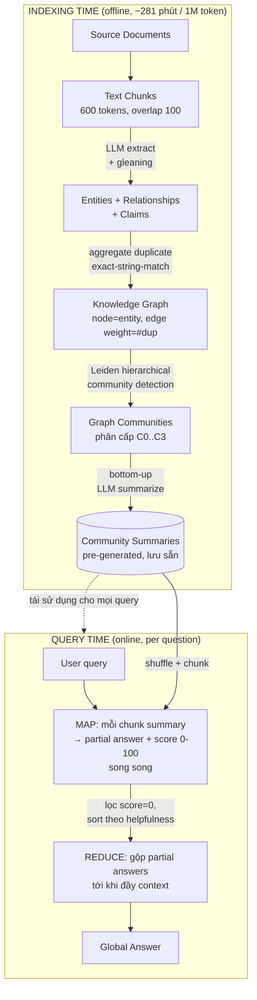

# 01 — Method walkthrough

> AI-generated. Method critique ở cuối — chỗ AI flag là dev/system angle, không phải claim của paper.

## Architecture sketch

Hai pha tách biệt: **Indexing time** (chạy 1 lần / mỗi lần corpus đổi) và **Query time** (chạy mỗi câu hỏi).

Tương đương Fig. 1 của paper nhưng làm rõ: (a) ranh giới offline/online, (b) community summary là **vật liệu được tính sẵn** rồi tái dùng, (c) gleaning nằm trong bước extract.

## Components

### Component 1: Text chunking
- **Purpose**: cắt corpus thành đơn vị LLM xử lý được.
- **Input**: documents thô. **Output**: chunks 600 token (overlap 100).
- **Key technique**: chunk size là design knob — chunk lớn → ít lời gọi LLM (rẻ) nhưng "degraded recall of information that appears early in the chunk" (§3.1.1, p.4). Gleaning (Component 2) bù lại nhược điểm này.
- **Anchor**: §3.1.1, p.4.

### Component 2: Entity & Relationship (& Claim) extraction
- **Purpose**: biến text → các bộ ba có cấu trúc.
- **Input**: 1 chunk. **Output**: list delimited tuples `("entity"|name|type|description)` và `("relationship"|source|target|description|strength)`; tùy chọn thêm claims (fact kiểm chứng được về entity).
- **Key technique**: multi-part prompt single-pass (nhận diện entity trước, rồi quan hệ giữa các entity "clearly related"), few-shot domain-tailored. **Gleaning / self-reflection**: sau extract, hỏi lại LLM "có sót entity không?" với `logit_bias=100` ép yes/no; nếu "yes" thì prompt *"MANY entities were missed"* để moi thêm; lặp tới max lần. Cho phép dùng chunk lớn mà không tụt recall (§A.2, Fig. 3).
- **Anchor**: §3.1.2, p.4–5; §A.1–A.2, p.18; prompt đầy đủ §E.1, p.21.

### Component 3: Graph construction
- **Purpose**: hợp nhất các instance trùng lặp thành graph.
- **Input**: tuples từ mọi chunk. **Output**: knowledge graph (node=entity, edge=relationship).
- **Key technique**: cùng entity bị trích nhiều lần ở nhiều chunk → gộp description; **edge weight = số lần quan hệ lặp lại**. Entity matching dùng **exact string matching** ("softer matching… can be used with minor adjustments" nhưng KHÔNG test). Tự nhận resilient với trùng lặp vì "duplicates are typically clustered together for summarization" (§3.1.3, p.5).
- **Anchor**: §3.1.3, p.5.

### Component 4: Community detection
- **Purpose**: phân graph thành cụm chủ đề phân cấp.
- **Input**: knowledge graph. **Output**: phân hoạch phân cấp các community (level 0 = root → leaf).
- **Key technique**: **Leiden** (Traag et al. 2019) chạy đệ quy — phát hiện sub-community trong mỗi community tới khi không chia được nữa. Mỗi level là phân hoạch **MECE** (mutually exclusive, collectively exhaustive) → "enabling divide-and-conquer global summarization" (§3.1.4, p.5–6). Cài bằng thư viện `graspologic` (§4.1.3).
- **Anchor**: §3.1.4, p.5–6; ví dụ trực quan §B/Fig. 4, p.18–19.

### Component 5: Community summarization (bottom-up)
- **Purpose**: viết "báo cáo" cho mỗi cụm, dùng được kể cả khi chưa có query.
- **Input**: element summaries (node/edge/claim) của 1 community. **Output**: 1 community summary dạng report (title, summary, impact rating, findings — xem prompt §E.2).
- **Key technique**: **Leaf-level** — ưu tiên element theo thứ tự degree giảm dần (node nổi bật trước), nhồi vào context tới khi đầy token. **Higher-level** — nếu mọi element summary vừa context → tóm tất cả; nếu không → thay element summary (dài) bằng sub-community summary (ngắn) theo thứ tự token giảm dần tới khi vừa. Đây là cơ chế "roll-up" tiết kiệm token cốt lõi.
- **Anchor**: §3.1.5, p.5–6.

### Component 6: Query-time map-reduce
- **Purpose**: từ community summaries → câu trả lời toàn cục cho 1 query.
- **Input**: query + community summaries ở 1 level đã chọn (C0/C1/C2/C3). **Output**: global answer.
- **Key technique**: (1) **Prepare** — community summaries *shuffle ngẫu nhiên* rồi chia chunk "to ensure relevant information is distributed across chunks, rather than concentrated (and potentially lost) in a single context window" (§3.1.6, p.6); (2) **Map** — mỗi chunk → partial answer song song + LLM tự chấm helpfulness 0–100, lọc bỏ score 0; (3) **Reduce** — sort partial answer theo helpfulness giảm dần, nhồi vào context tới khi đầy → sinh global answer.
- **Anchor**: §3.1.6, p.6.

## Key technique deep dive

Cú "trick" trung tâm không phải graph — mà là **dời QFS từ query time sang index time bằng phân hoạch MECE**. QFS cổ điển không scale tới khối lượng RAG; vector RAG không làm được sensemaking toàn cục. GraphRAG cắt nút thắt bằng cách: thay vì tóm tắt toàn corpus mỗi lần hỏi, **chia corpus thành các cụm rời-nhau-phủ-hết rồi tóm tắt sẵn từng cụm**. Map-reduce trên các cụm cho phép "divide-and-conquer" — mỗi cụm trả lời độc lập song song, rồi gộp. Graph + Leiden chỉ là *phương tiện* tạo ra phân hoạch MECE đó. Điều này lý giải vì sao TS (map-reduce thẳng trên source text, không graph) gần ngang GraphRAG: bản chất lợi ích đến từ *cấu trúc divide-and-conquer toàn cục*, graph là một cách (không nhất thiết là cách tốt nhất) để có cấu trúc đó.

Insight phụ đáng giá: **prioritization theo node degree** ở bước summarize (§3.1.5) là một heuristic "cái gì nổi bật về cấu trúc thì quan trọng về nội dung" — kế thừa giả định modularity. Và **helpfulness self-scoring** ở map step (§3.1.6) là một bộ lọc rẻ để tránh reduce-context bị nhiễu bởi cụm vô quan.

## Data flow walkthrough

Ví dụ query: *"Những nhân vật công chúng nào được nhắc lặp lại trên các bài entertainment?"* (ví dụ thật §D, p.20).

1. **Input**: query trên (corpus = News articles, đã index sẵn).
2. **Chọn level**: giả sử C2 (intermediate). Lấy toàn bộ community summaries ở C2.
3. **Prepare**: shuffle các C2 summary, chia thành chunk theo token (§3.1.6).
4. **Map**: mỗi chunk → LLM sinh partial answer ("nhóm diễn viên: …", "nhóm thể thao: …") + self-score helpfulness; chunk không liên quan → score thấp/0 → loại.
5. **Reduce**: sort partial theo helpfulness, gộp tới đầy context → global answer liệt kê đủ Actors/Directors, Musicians, Athletes, Influencers… kèm data reference `[Data: Reports (...)]`.
6. **Output**: câu trả lời dài, có cấu trúc theo nhóm — LLM-judge chấm thắng vector RAG ở Comprehensiveness/Diversity/Empowerment, **thua ở Directness** (vector RAG liệt kê thẳng "Taylor Swift, Travis Kelce…" ngắn gọn hơn) (§D, p.20).

## Implementation notes

- LLM: `gpt-4-turbo` (public OpenAI endpoint, 2M TPM / 10k RPM); query-time context window cố định **8k tokens** (test 8/16/32/64k, 8k thắng — §C, p.19).
- Leiden: thư viện `graspologic` (Chung et al. 2019). Layout hình minh hoạ: OpenORD + Force Atlas 2.
- Claim extraction validation: **Claimify** (Metropolitansky & Larson 2025).
- Open-source: github.com/microsoft/graphrag; có tích hợp LangChain, LlamaIndex, NebulaGraph, Neo4j.
- Indexing cost mẫu: 281 phút cho Podcast ~1M token.

## Critique của method

- **Entity resolution = exact string match là điểm gãy thầm lặng.** "HUTECH" / "Trường ĐH Công nghệ TP.HCM" / "Ho Chi Minh City University of Technology" thành 3 node khác nhau → graph phân mảnh, community sai. Paper xua tay "softer matching can be used" nhưng không test (§3.1.3). Với corpus đa ngôn ngữ / nhiều biến thể tên, đây là lỗ hổng nghiêm trọng.
- **Leiden chỉ nhìn cấu trúc, mù ngữ nghĩa.** Community detection dựa thuần vào topology (degree, modularity), bỏ qua nội dung text/embedding của node. Hai cụm có thể "modular về cấu trúc" nhưng trộn lẫn chủ đề ngữ nghĩa. → khe hở thay Leiden bằng phân cụm dựa GNN/embedding (xem `04`).
- **Map step quét toàn bộ community → đắt tuyến tính theo số cụm.** C3 (nhiều cụm nhất) mọi cụm đều tốn 1 lời gọi map dù query chỉ liên quan 1–2 cụm. Không có routing/pruning — paper để dành cho future work ("local"/"drill-down"). Đây là chi phí query-time bị giấu sau con số "indexing time".
- **Shuffle ngẫu nhiên community summaries** (§3.1.6) là hack chống "lost in the middle" nhưng làm kết quả phụ thuộc seed; paper không report độ nhạy theo seed của shuffle.
- **Graph là homogeneous (1 loại node, edge generic).** Không có node type, không meta-path, không learned embedding. Đây chính là điểm khiến "graph" trong GraphRAG nông — và là delta tự nhiên cho hướng HIN/GNN của advisor.

## 🔍 Verify list
- Verify: ở map step, partial answers được sinh ở *cùng* community level đã chọn (C0/C1/C2/C3) hay trộn nhiều level — đọc §3.1.6 thấy là 1 level/lần nhưng confirm lại trên code repo nếu định reproduce.
- Verify: "helpfulness score 0 filtered out" — score 0 mới loại hay có threshold khác; §3.1.6 chỉ nói score 0.
